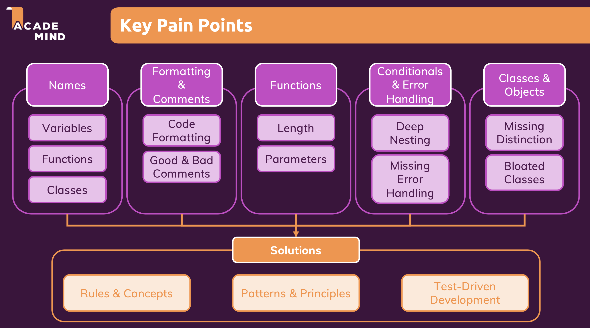
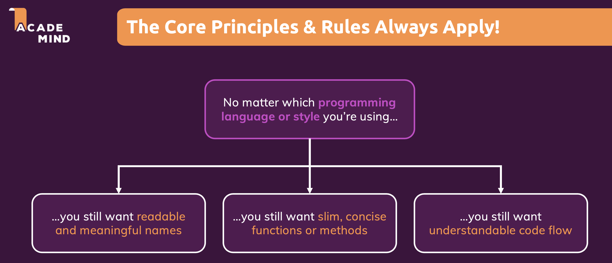
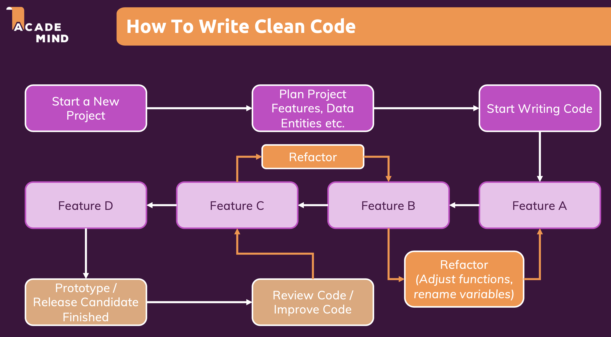
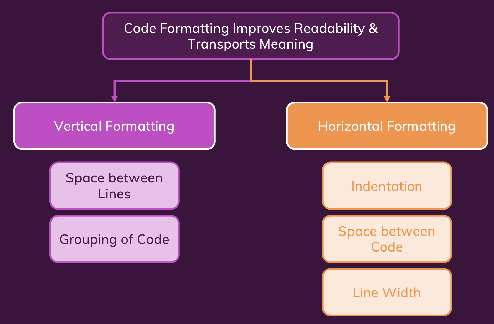
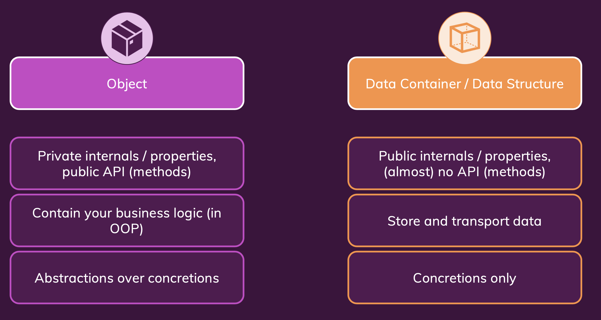

# Clean Code







## Naming

Naming things (*= variables, properties, functions, methods, classes*) correctly and in an understandable way if **an extremely important part of writing clean code.**

Indeed - if poor names are chosen - pretty much all other concepts taught throughout the course will **not help that much**.

Link: [Document Naming](https://khoispace.notion.site/Naming-34fad00b0487436fa21bca80a3f110b6)

## Comments & Formatting

You could think that comments help with code readability. In reality, the **opposite is often the case** though.

Proper **code formatting** (i.e. keeping lines short, adding blank lines etc.) on the other hand **helps a lot with reading** and understanding code.

Link: [Document Comments & Formatting](https://khoispace.notion.site/Comments-Formatting-bc3fdf87af944aa9ad16d3dd08e3798b)

### Bad Comments

| Type | Description |
|------|-------------|
| Dividers & Markers |Dividers and markers are redundant. If you code is written in a clean way (i.e. you use proper names etc.), it's obvious what your different code parts are about. |
| Redundant Information | Comments like in this example **add nothing**. Instead, you stop and spend time reading them - just to learn what you already knew because the code used proper names. |
| Commented Out Code | Commented out code is dead code. It should be removed. If you want to keep it, use a version control system. |
| Misleading Comments | Misleading comments are the worst. They make you think that the code does something else than it actually does. |

### Good Comments

| Type | Description |
|------|-------------|
| Legal Information | In some projects and/ or companies, you could be required to add legal information to your code files. |
| "Required" Explanations | In rare cases, adding extra explanations next to your code does help - even if you named everything properly. |
| Warnings | Also in rare cases, warnings next to some code could make sense - for example if a unit test may take a long time to complete or if a certain functionality won't work in certain environments. |
| Todo Notes | Even though, you shouldn't over-do it, adding "Todo" notes can also be okay. |

### Formatting



## Functions (& Methods)

Functions and methods (I don't differentiate here) are the meat of any code we write. All
our code is part of some function or method after all. And we use functions to call other
functions, build re-usable functionalities and more.

That's why it's extremely important to write clean functions.
Functions are made up of three main parts:

- Their name
- Their parameters (if any)
- Their body

The naming of functions and methods is covered in the "Naming" section already. This
section cheat sheet focuses on the parameters and body therefore.

| Type | Description |
|------|-------------|
| Minimize The Number Of Parameters | The fewer parameters a function has, the easier it is to read and call (and the easier it is to read and understand statements where a function is called). |
| Keep Functions Small | Besides the number of parameters, the function body should also be kept small. |
| Do One Thing | In order to be small, functions should just do one thing. Exactly one thing. This ensures that a function doesn't do too much. |
| Levels of Abstraction | Levels of abstraction can be confusing but in the end, it's quite straightforward concept. |
| Rules Of Thumb | The concept of "levels of abstraction" can be scary and you absolutely should NOT spend hours on your code, just to analyze which levels you migth have there. |

Link: [Document Functions (Methods)](https://khoispace.notion.site/Functions-Methods-c3b9e5a4169f46d7bda38da3029c05f8)

## Control Structures

No matter which kind of application you're building - you will most likely also use control structures in your code: if statements, for loops, maybe also while loops or switch-case statements.

Control structures are extremely important to coordinate code flow and of course you should use them.

But control structures **can also lead to bad or suboptimal code** and hence play an important role when it comes to writing clean code.

| Type | Description |
|------|-------------|
| Prefer Positive Checks | This is a simple one. It can make sense to use positive wording in your if checks instead of negative wording. Though - in my opinion at least - sometimes a short negative phrase is better than a constructed positive one. |
| Avoid Deep Nesting | This is very important! You should absolutely avoid deeply nested control structures since such code is highly unreadable, hard to maintain and also often error-prone. |
| Polymorphism & Factory Functions | Sometimes, you end up with duplicated if statements and duplicated checks just because the code inside of these statements differs slightly. |
| Embrace Errors | Errors are another nice way of getting rid of redundant if checks. They allow us to utilize mechanisms built into the programming language to handle problems in the place where they should be handled (and cause them in the place where they should be caused...). |

Link: [Document Control Structures](https://khoispace.notion.site/Control-Structures-4ea890d89c1f4dcb9088c19a4d80d376)

## Classes, Objects & Data Containers

Objects vs Data Containers / Data Structures


- Classes are blueprints for objects.
- Polymorphism is a fancy term but in the end it just means that you re-use code (e.g. call the same method) multiple times but that the code will do different things, depending on the object type.
- Classes Should Be Small

Link: [Document Classes, Objects & Data Containers](https://khoispace.notion.site/Classes-Objects-Data-Containers-45f8ee8ca9ee4e3db454aa711effaa2a?pvs=4)

## SOLID Principles

### S: Single-Responsibility Principle (SRP)

A class should only have a single responsibility - it should only change for this one responsibility.

```python
class ReportDocument:
    def generate_report(self, data):
        # Implement the logic for generating a report using the provided data
        pass

    def create_pdf(self, report):
        # Implement the logic for creating a PDF from the generated report
        pass
```

### O: Open-Closed Principle (OCP)

A class should be open for extension but closed for modification.

```python
from abc import ABC, abstractmethod

class Printer(ABC):
    @abstractmethod
    def print(self, data):
        pass

class PrinterImplementation:
    def verify_data(self, data):
        # Implement the logic for verifying data
        pass

class WebPrinter(PrinterImplementation, Printer):
    def print(self, data):
        # Implement the logic for printing a web document
        pass

class PDFPrinter(PrinterImplementation, Printer):
    def print(self, data):
        # Implement the logic for printing a PDF document
        pass

class PagePrinter(PrinterImplementation, Printer):
    def print(self, data):
        # Implement the logic for printing a real page
        pass
```

### L: Liskov Substitution Principle (LSP)

Objects in a program should be replaceable with instances of their subtypes.

```python
class Bird:
    pass

class FlyingBird(Bird):
    def fly(self):
        print('Flying...')

class Eagle(FlyingBird):
    def dive(self):
        print('Diving...')

# Instantiate and use Eagle
eagle = Eagle()
eagle.fly()
eagle.dive()

class Penguin(Bird):
    pass
```

### I: Interface Segregation Principle (ISP)

Many client-specific interfaces are better than one general-purpose interface.

```python
from abc import ABC, abstractmethod

class Database(ABC):
    @abstractmethod
    def store_data(self, data):
        pass

class RemoteDatabase(ABC):
    @abstractmethod
    def connect(self, uri):
        pass

class SQLDatabase(Database, RemoteDatabase):
    def connect(self, uri):
        # connecting...
        pass

    def store_data(self, data):
        # Storing data...
        pass

class InMemoryDatabase(Database):
    def store_data(self, data):
        # Storing data...
        pass
```

### D: Dependency Inversion Principle (DIP)

One should depend upon abstractions, not concretions.

```python
from abc import ABC, abstractmethod

class Database(ABC):
    @abstractmethod
    def store_data(self, data):
        pass

class SQLDatabase(Database):
    def connect(self, uri):
        # connecting...
        print(f"Connected to {uri}")

    def store_data(self, data):
        # Storing data...
        print(f"Stored data: {data}")

class App:
    def __init__(self, database):
        self.database = database

    def save_settings(self):
        self.database.store_data('Some data')

# Instantiate SQLDatabase and App
sql_database = SQLDatabase()
sql_database.connect('my-url')
app = App(sql_database)

# Use the App instance
app.save_settings()
```
